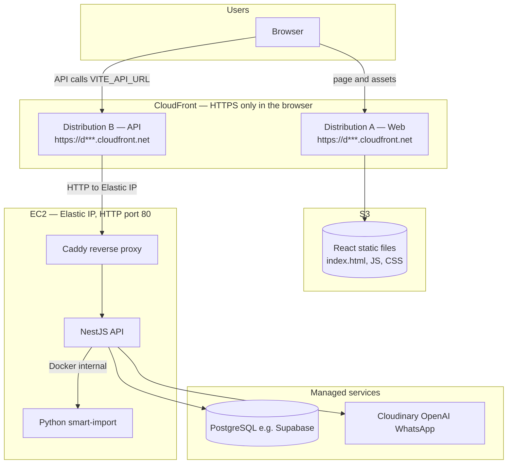
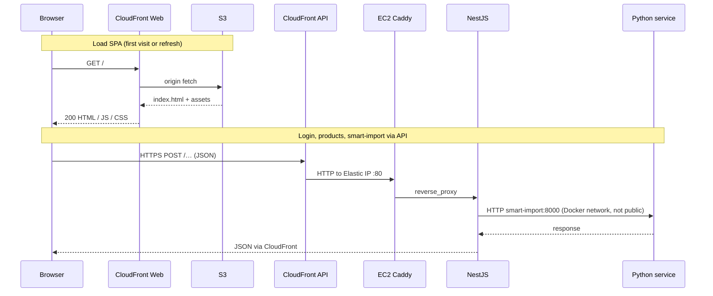

# AWS deployment (EC2 + Docker + CloudFront, **no custom domain**)

**You do not need a domain name.** You never register DNS, Route 53, or SSL for `api.example.com`. Everything uses:

| What            | Public URL you use                                      |
|-----------------|---------------------------------------------------------|
| Website (React) | `https://dxxxxxxxx.cloudfront.net` (from CloudFront #1) |
| API (Nest)      | `https://dyyyyyyyy.cloudfront.net` (from CloudFront #2) |
| EC2 server      | **Elastic IP** only as the **private** origin (HTTP port 80) |

Stack: **Nest + Python** on one EC2 (**Elastic IP**), **React** on **S3 + CloudFront**. Browsers only see the two **HTTPS** `*.cloudfront.net` URLs above.

## Architecture (visual)

High-level: **two CloudFront distributions** (two `*.cloudfront.net` URLs), **one EC2** running Docker, **S3** for static files, **Supabase** (or any Postgres) outside this diagram.



Typical **request flows** (no custom domain):



---

## Why the API is not `http://YOUR_IP` in the browser

The app is served from **HTTPS** CloudFront (`https://dxxxxx.cloudfront.net`). Browsers **block** calls from that page to **`http://<elastic-ip>`** (mixed content).

**Practical IP-only setup:** give the API an **HTTPS URL** using a **second CloudFront distribution** whose **custom origin** is your EC2 **Elastic IP** on **port 80** (HTTP). Your app then uses:

- **Frontend:** `https://d111111.cloudfront.net` (S3 origin)
- **API:** `https://d222222.cloudfront.net` (origin = `http://YOUR_ELASTIC_IP`, no TLS on EC2)

You still do **not** buy or configure a custom domain.

---

## Prerequisites

- AWS account
- `git`, optional `aws cli` for S3 sync

---

## Part A — EC2

1. **EC2** → **Launch instance** → Ubuntu 24.04 (or 22.04).
2. **Instance type:** `t3a.medium` or larger if smart-import feels slow.
3. **Key pair:** create and download `.pem`.
4. **Storage:** 30–40 GiB gp3.
5. **Security group:**
   - **SSH 22** — your IP only
   - **HTTP 80** — **0.0.0.0/0** (Caddy)
   - **443** — optional; not required if EC2 only serves HTTP on 80 (see compose file)
6. **Launch**.

### Elastic IP (keep the same API target for CloudFront)

1. **EC2** → **Elastic IPs** → **Allocate** → **Associate** to the instance.
2. Note this IP (e.g. `54.209.9.255`).

---

## Part B — Docker on the server

```bash
chmod 400 /path/to/your-key.pem
ssh -i /path/to/your-key.pem ubuntu@YOUR_ELASTIC_IP
```

Install Docker (Ubuntu):

```bash
sudo apt-get update
sudo apt-get install -y ca-certificates curl
sudo install -m 0755 -d /etc/apt/keyrings
sudo curl -fsSL https://download.docker.com/linux/ubuntu/gpg -o /etc/apt/keyrings/docker.asc
sudo chmod a+r /etc/apt/keyrings/docker.asc
echo "deb [arch=$(dpkg --print-architecture) signed-by=/etc/apt/keyrings/docker.asc] https://download.docker.com/linux/ubuntu $(. /etc/os-release && echo "${VERSION_CODENAME:-$VERSION}") stable" | sudo tee /etc/apt/sources.list.d/docker.list > /dev/null
sudo apt-get update
sudo apt-get install -y docker-ce docker-ce-cli containerd.io docker-compose-plugin
sudo usermod -aG docker ubuntu
```

Log out and SSH again so `docker` works without `sudo`.

---

## Part C — API containers

```bash
sudo mkdir -p /opt/bot-uncle && sudo chown ubuntu:ubuntu /opt/bot-uncle
cd /opt/bot-uncle
git clone YOUR_REPO_URL .
cd deploy
cp backend.env.example backend.env
cp smart-import.env.example smart-import.env
cp Caddyfile.example Caddyfile
nano backend.env
nano smart-import.env
```

**`backend.env` (IP / no domain)**

- `PYTHON_SERVICE_URL=http://smart-import:8000`
- `UPLOAD_DIR=/app/uploads`
- `NODE_ENV=production`, `TRUST_PROXY=1`
- **`ALLOWED_ORIGINS`** — the **frontend** CloudFront URL(s) only, exact origin, comma-separated, e.g. `https://d111111abcdef8.cloudfront.net`  
  (Add the **API** CloudFront URL too only if browsers ever call it as a page origin; normally they do not.)
- **`Caddyfile`** — default listens on **`:80`** and proxies to the backend (no TLS on the instance).

```bash
docker compose up -d --build
docker compose ps
curl -s http://127.0.0.1/health/live
```

Updates:

```bash
cd /opt/bot-uncle/deploy && git pull && docker compose up -d --build
```

---

## Part D — Frontend S3 bucket

1. **S3** → create bucket (private, Block Public Access on).
2. Sync `frontend/dist/` after build (Console or `aws s3 sync`).

---

## Part E — CloudFront #1 (website, S3)

1. Create distribution → origin = S3 (OAC).
2. **Default root object:** `index.html`
3. **Viewer protocol:** Redirect HTTP to HTTPS
4. **SPA:** Custom error **403** (and **404**) → `/index.html` with response code **200**

Note **`https://d111111....cloudfront.net`**.

---

## Part F — CloudFront #2 (API in front of Elastic IP)

1. Create **another** distribution.
2. **Origin:**
   - **Origin domain:** enter your **Elastic IP** as a **custom origin** (paste `http://YOUR_ELASTIC_IP` in the console’s custom origin field, or domain field depending on UI — use the IP as hostname; **protocol HTTP**, **port 80**).
3. **Origin protocol policy:** HTTP only (origin is Caddy on port 80).
4. **Allowed HTTP methods:** GET, HEAD, OPTIONS, PUT, POST, PATCH, DELETE (match what your API uses).
5. **Cache policy:** for APIs, use **CachingDisabled** or a policy that forwards `Authorization`, query strings, and relevant headers.
6. **Viewer protocol:** Redirect HTTP to HTTPS.

Note **`https://d222222....cloudfront.net`** — this is your **public API base URL**.

---

## Part G — Build frontend with the API CloudFront URL

```bash
cd frontend
echo 'VITE_API_URL=https://d222222....cloudfront.net' > .env.production
npm ci && npm run build
```

Upload **`dist/`** to S3, invalidate CloudFront #1 if needed.

**`ALLOWED_ORIGINS`** on EC2 must include the **frontend** URL:

`ALLOWED_ORIGINS=https://d111111....cloudfront.net`

Then on the server:

```bash
cd /opt/bot-uncle/deploy && docker compose up -d
```

---

## WhatsApp webhooks (Meta)

Meta expects a **public HTTPS** callback. With no domain, use the **API CloudFront URL** as the webhook base (e.g. `https://d222222....cloudfront.net/...` path your Nest app uses), as long as CloudFront forwards POST body and headers your route needs. If verification fails, check **cache behaviors** and forwarded headers/methods for that path.

---

## Checklist

- [ ] Elastic IP associated with the instance
- [ ] Security group: **80** open to the world; **22** restricted
- [ ] **Two** CloudFront distributions (or one distribution with multiple origins/behaviors if you prefer)
- [ ] `VITE_API_URL` = **HTTPS** API CloudFront URL (not `http://ip`)
- [ ] `ALLOWED_ORIGINS` = **HTTPS** frontend CloudFront URL
- [ ] Secrets only in `backend.env` / `smart-import.env`
