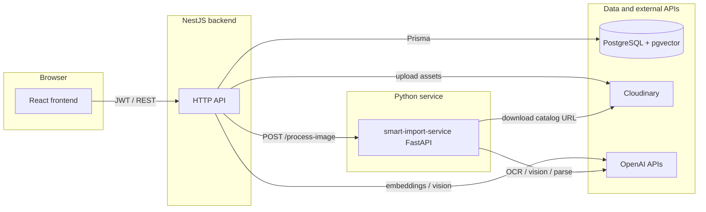
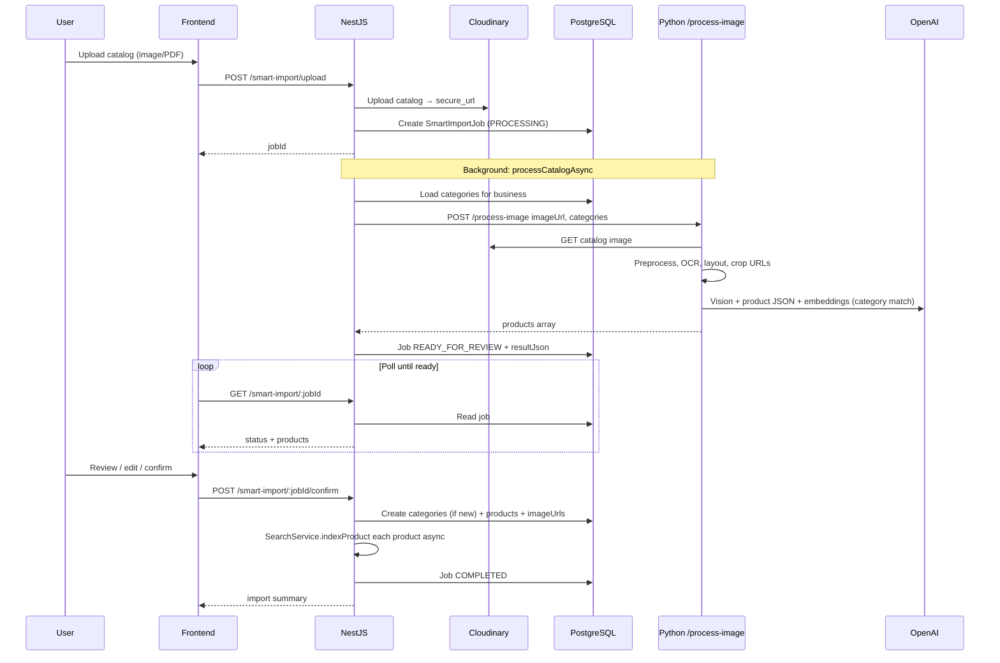
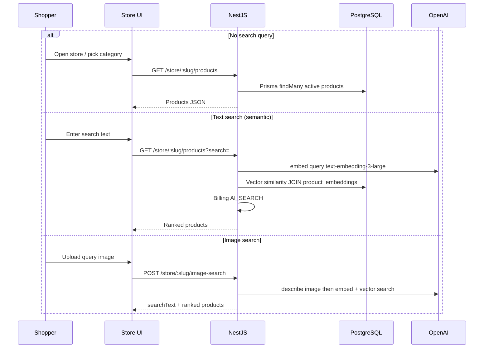

# System architecture & data flows

This document describes how the main applications connect and how data moves through **Smart Import**, **dashboard products**, and **store AI search**. Diagrams use [Mermaid](https://mermaid.js.org/) (render in GitHub, VS Code, or [mermaid.live](https://mermaid.live)).

---

## 1. Containers (who talks to whom)



| Component | Role |
|-----------|------|
| **Frontend** | Dashboard (products, smart import) and public store; calls only the Nest API base URL. |
| **NestJS** | Auth, products/categories/store routes, billing, smart-import jobs, image upload, **`SearchService`** (index + query). |
| **smart-import-service** | Stateless catalog pipeline: preprocess → OCR → layout → GPT vision → GPT extract → category embedding match → returns JSON products. |
| **PostgreSQL** | Products, categories, businesses, `smart_import_jobs`, **`product_embeddings`** (vectors). |
| **Cloudinary** | Catalog uploads (`catalog-imports`), product images (`product-images`), cropped regions from import. |
| **OpenAI** | Chat/vision (descriptions, catalog parsing), **`text-embedding-3-large`** (Nest search index + queries), **`text-embedding-3-small`** (Python category matcher). |

Nest is configured with **`PYTHON_SERVICE_URL`** (default `http://localhost:8000`) for Smart Import.

---

## 2. Smart Import (end-to-end)



**Python pipeline (logical order):** download raster → OCR (e.g. Tesseract) → layout hints (LayoutLM / OpenCV fallback) → GPT-4o-mini vision summary → GPT extract structured products → optional Cloudinary crops → **`category_matcher`**: embed product labels vs category names, apply similarity threshold + exact name match → response.

---

## 3. Dashboard: add product and search index

```mermaid
sequenceDiagram
  participant U as User
  participant FE as Frontend
  participant Nest as NestJS
  participant OAI as OpenAI
  participant CL as Cloudinary
  participant PG as PostgreSQL

  opt Optional: image preview before save
    FE->>Nest: POST /products/image-description/preview
    Nest->>OAI: Vision on file (data URL)
    Nest-->>FE: description
    Note over FE: Append to line 3; skipImageVision on upload if preview succeeded
  end

  U->>FE: Submit form
  FE->>Nest: POST /products
  Nest->>PG: INSERT product (often imageUrls empty)
  Nest->>Nest: indexProduct(id) async
  Nest->>PG: Load product; build docText from name/category/price/lines
  Nest->>OAI: text-embedding-3-large(docText)
  Nest->>PG: UPSERT product_embeddings

  opt If new image file
    FE->>Nest: POST /products/:id/images optional skipImageVision
    Nest->>CL: Upload images
    Nest->>PG: UPDATE imageUrls
    Nest->>Nest: indexProduct with optional skip vision
    Note over Nest: If skip: no second vision call; docText uses lines including line 3
    Nest->>OAI: embedding only
    Nest->>PG: UPSERT product_embeddings
  end
```

---

## 4. Public store: list vs AI search



---

## 5. Where state lives (quick reference)

| Concern | Storage / service |
|--------|-------------------|
| Product rows | `products` (Prisma) |
| Semantic retrieval | `product_embeddings` (`embedding`, `source_text`) |
| Import jobs | `smart_import_jobs` + `resultJson` |
| Category matcher tuning | Python env `SMART_IMPORT_CATEGORY_MATCH_THRESHOLD` |
| Python service URL | Nest `PYTHON_SERVICE_URL` |

---

## 6. How to view these diagrams

- **GitHub**: Mermaid renders in `.md` files automatically.
- **VS Code**: “Markdown Preview Mermaid Support” or similar extension.
- **Export PNG/SVG**: Paste into [mermaid.live](https://mermaid.live) and export.

For a single **poster** diagram (all boxes on one canvas), copy the container diagram into [draw.io](https://app.diagrams.net/) and expand manually.
