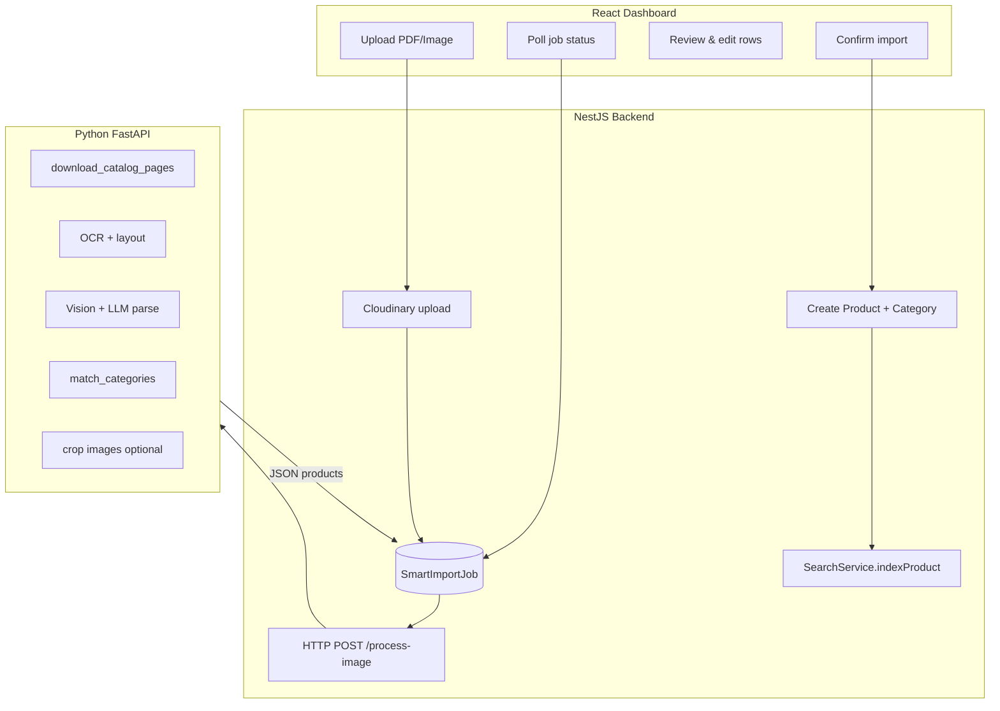
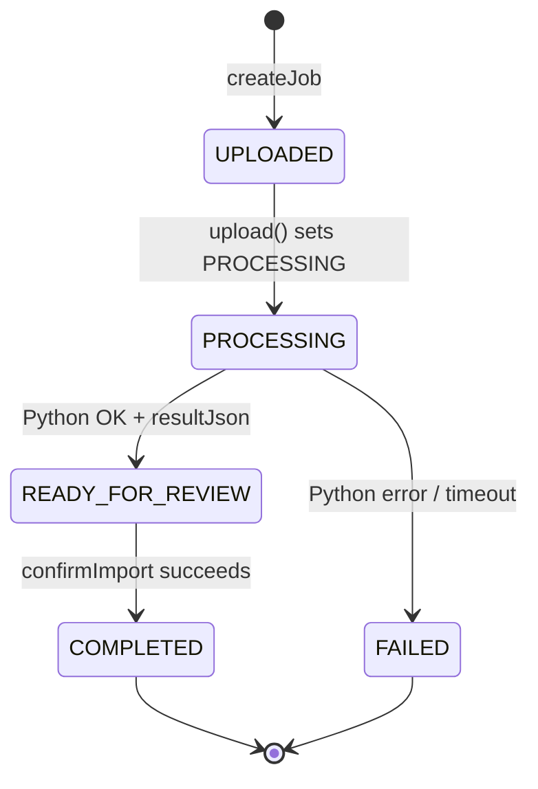
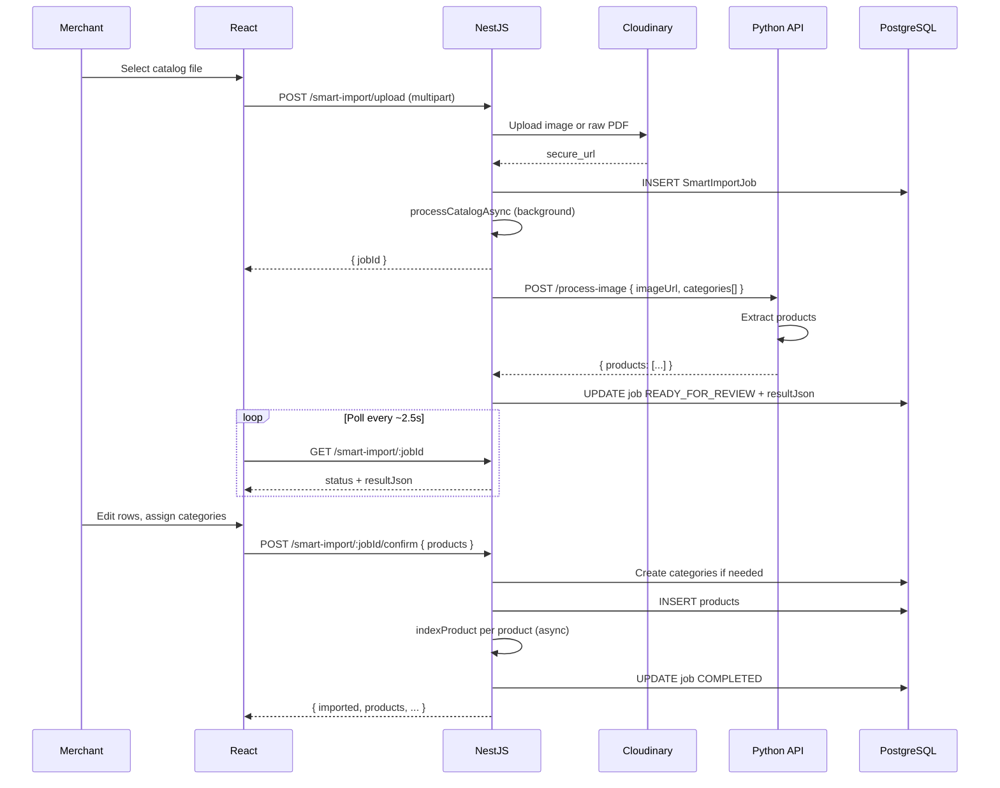
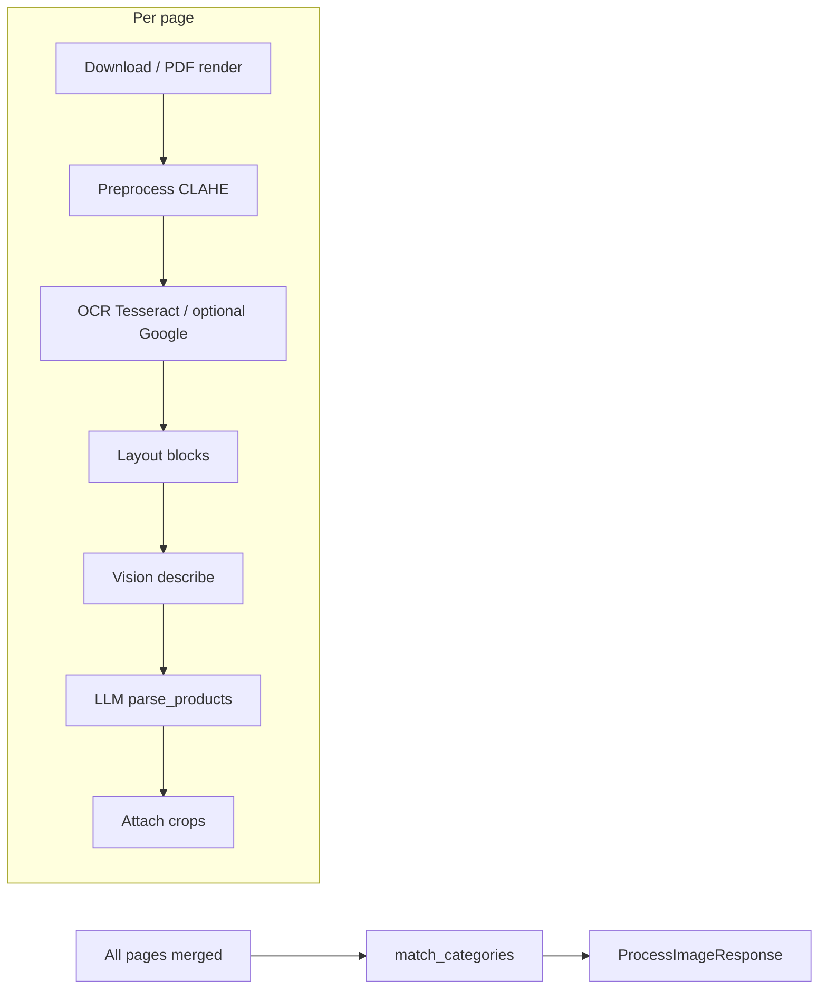

# Smart Import — Feature Specification & Workflows

This document describes **Smart Import**: AI-assisted ingestion of catalog **images** or **PDFs** into merchant products. It covers architecture, state machines, end-to-end workflows, APIs, and the Python extraction pipeline.

---

## 1. Purpose

| Goal | Description |
|------|-------------|
| **Reduce manual data entry** | Upload a supplier catalog; the system extracts candidate products (name, price, lines, categories, optional crops). |
| **Human-in-the-loop** | Nothing is written to the product catalog until the merchant **reviews and confirms** in the dashboard. |
| **Search readiness** | After confirmation, products are created in PostgreSQL and **embedding index** runs asynchronously for semantic search. |

---

## 2. High-level architecture

Three components cooperate:

1. **NestJS backend** — Auth, file upload to Cloudinary, `SmartImportJob` persistence, orchestration of the Python service, product/category creation on confirm, embedding calls.
2. **Python FastAPI service** (`smart-import-service`) — Download URL → preprocess → OCR → layout → vision → LLM parse → category matching → optional image crops.
3. **React dashboard** — Upload wizard, polling, editable review table, confirm import.



---

## 3. Data model (backend)

Defined in Prisma (`SmartImportJob`):

| Field | Role |
|-------|------|
| `id` | Job UUID returned to the client as `jobId`. |
| `businessId` | Tenant scope; all routes validate ownership. |
| `fileUrl` | **HTTPS URL** of the uploaded file on Cloudinary (Python downloads this). |
| `status` | Lifecycle enum (see below). |
| `resultJson` | Nullable until success; shape `{ products: ExtractedProduct[] }` aligned with Python response. |

### 3.1 Import status state machine



**Notes:**

- Initial create uses default status `UPLOADED` (schema default); the service immediately moves to `PROCESSING` and starts async work.
- `confirmImport` is allowed when status is `READY_FOR_REVIEW` **or** `COMPLETED` (re-confirm edge case — still validates business rules).

---

## 4. End-to-end workflow (sequence)



---

## 5. Backend workflow (NestJS)

### 5.1 Authentication & tenancy

- All routes use `JwtAuthGuard`.
- `businessId` comes from `req.user.businessId` or is resolved via `BusinessService.findByUserId` when missing.

### 5.2 `POST /smart-import/upload`

1. **Multipart field** name: `image` (images or PDF).
2. **Validation**: images by MIME prefix `image/*`, PDF as `application/pdf`; max **50 MB**.
3. **Cloudinary**
   - Raster: `folder: catalog-imports`, `quality: auto`.
   - PDF: `resource_type: raw` so the URL serves PDF bytes for the Python downloader.
4. **Job**: `createJob(businessId, fileUrl)`.
5. **Categories** for Python: `findMany` `{ id, name }` ordered by `displayOrder`.
6. **Async**: `processCatalogAsync(jobId, fileUrl, categories)` — does not block the HTTP response.
7. **Status**: `updateJobStatus(jobId, PROCESSING)` before returning `{ jobId }`.

### 5.3 Background call to Python

- **URL**: `PYTHON_SERVICE_URL` (env) or `http://localhost:8000`.
- **Endpoint**: `POST /process-image`.
- **Timeout**: 120 seconds (HTTP client).
- **Body**: `{ imageUrl, categories }` — `imageUrl` is the Cloudinary `secure_url`.
- **Success**: `updateJobStatus(jobId, READY_FOR_REVIEW, resultJson)`.
- **Failure**: log error; `updateJobStatus(jobId, FAILED)` (no `resultJson`).

### 5.4 `GET /smart-import/:jobId`

- Returns `{ jobId, status, fileUrl, resultJson, createdAt, updatedAt }`.
- **404** if job not found for this `businessId`.

### 5.5 `POST /smart-import/:jobId/confirm`

**Request body:** `{ products: ConfirmProductDto[] }`.

**Rules:**

| Rule | Detail |
|------|--------|
| Min/max | At least one product; **max 20** products per confirm. |
| Category | Each row must have **`categoryId`** (existing) **or** **`newCategoryName`** (create or reuse by slug). |
| Existing IDs | All `categoryId` values must belong to the same `businessId`. |
| New categories | Deduplicated by name; **slug** = `generateSlug(name)`; **upsert** by unique `(businessId, slug)`. |
| Products | `create` with `name`, `price`, `line1`–`line3`, `imageUrls`. |
| Embeddings | For each created product, `searchService.indexProduct(id)` — **fire-and-forget** with error logging. |
| Job | `updateJobStatus(jobId, COMPLETED)`. |

**Response:** `{ imported, newCategoriesCreated, products }`.

### 5.6 Billing (confirm)

- Handler is decorated with `@BillableAction(BillingActions.SMART_IMPORT, { unitsResolver })`.
- **`unitsResolver`** reads the **response body** after the handler completes: it uses **`imported`** (number of products created) when present; otherwise **1**.
- Charges run inside `BillingInterceptor` via `BillingService.safeCharge` (usage log + balance update).

---

## 6. Python AI pipeline workflow

Entry: **`POST /process-image`** (`app/routes/import_routes.py`).

### 6.1 Request schema

```json
{
  "imageUrl": "https://...",
  "categories": [{ "id": "uuid", "name": "Electronics" }]
}
```

### 6.2 Page acquisition (`download_catalog_pages`)

1. **HTTP GET** the URL (follow redirects, timeout 120s).
2. If bytes look like **PDF** (magic `%PDF`) or `Content-Type` is `application/pdf` → render each page to RGB (`pdf_render`), then preprocess each page.
3. Else treat as **raster** → single page.
4. **Preprocess** (`pil_rgb_to_preprocessed`): cap width **2000px**, grayscale, Gaussian blur, **CLAHE** — tuned for OCR.

### 6.3 Per-page extraction (`_extract_products_one_page`)

1. **OCR**
   - Google Vision path exists in code but may be **disabled**; fallback is **Tesseract** with word boxes for layout.
2. **Layout** (if word boxes available)
   - `build_layout_context`: LayoutLMv3-style model when enabled, else clustering/OpenCV fallbacks (`layout_analysis/`).
3. **Vision**
   - `analyze_image_vision` — additional image-level context for the LLM.
4. **Parse**
   - `parse_products(ocr_text, vision_description, layout_context)` — structured `ExtractedProduct` list.
5. **Crops** (optional)
   - `attach_cropped_product_images` — map layout blocks to product thumbnails (e.g. Cloudinary URLs).

### 6.4 Merge and category pass

- Concatenate products from **all pages**.
- If `request.categories` is non-empty: **`match_categories`**
  - Uses **OpenAI embeddings** (`text-embedding-3-small`) and cosine similarity vs merchant category names; threshold **0.40**.
  - Can set `categoryId`, `isNewCategory`, `categorySuggestion`, etc.

### 6.5 Response schema (`ExtractedProduct`)

Key fields returned to Nest (stored in `resultJson`):

| Field | Meaning |
|-------|---------|
| `name`, `price`, `line1`–`line3` | Catalog text fields. |
| `category`, `categoryId`, `categorySuggestion` | AI category hints. |
| `isNewCategory` | Suggest creating a new category in UI. |
| `confidence` | 0–1 heuristic. |
| `imageUrls` | Optional cropped image URLs. |

Empty extraction → `{ products: [] }`.

---

## 7. Frontend workflow (`SmartImport.tsx`)

Wizard-style **steps**:

| Step | UI behavior |
|------|-------------|
| `idle` | File dragger; validates image/PDF. |
| `uploading` | POST upload. |
| `processing` | Poll `GET /smart-import/:jobId` every **2.5s** until `READY_FOR_REVIEW` or `FAILED`. |
| `review` | Table: edit name, price, lines, category (existing or new name), remove rows; confidence badges. |
| `importing` | POST confirm. |
| `done` | Success message; redirect to **Products**. |

**Polling:** transient errors during polling are ignored (keep polling). On `FAILED`, show error and reset to `idle`.

**Confirm payload:** maps each row to `ConfirmProduct`: either `categoryId` or `newCategoryName` from user choices (`_newCategoryName` when creating).

---

## 8. Configuration reference

| Variable / setting | Where | Role |
|--------------------|--------|------|
| `PYTHON_SERVICE_URL` | Nest `.env` | Base URL for FastAPI (default `http://localhost:8000`). |
| `CLOUDINARY_*` | Nest | Upload stream config in `SmartImportService`. |
| `OPENAI_API_KEY` | Nest | `SearchService.indexProduct` after import. |
| `OPENAI_API_KEY` | Python | Embeddings in `category_matcher`, LLM/vision in parser and vision modules (per service code). |
| `LAYOUT_*` / model envs | Python | Layout model enablement and limits (`layout_analysis/`). |

---

## 9. Failure modes & operations

| Scenario | Behavior |
|----------|----------|
| Python down / timeout | Job → `FAILED`; merchant sees failure after polling. |
| Unreadable catalog | May return **zero** products; review step still possible with empty list (confirm requires ≥1 product). |
| Large PDF | Multi-page loop; longer runtime — bounded by HTTP **120s** to Python. |
| Embedding failure after import | Logged; products still exist; search may be incomplete until re-indexed. |

---

## 10. File index (implementation map)

| Area | Path |
|------|------|
| Nest controller | `backend/src/smart-import/smart-import.controller.ts` |
| Nest service | `backend/src/smart-import/smart-import.service.ts` |
| Nest repository | `backend/src/smart-import/smart-import.repository.ts` |
| DTOs | `backend/src/smart-import/dto/confirm.dto.ts` |
| Prisma model | `backend/prisma/schema.prisma` → `SmartImportJob`, `ImportStatus` |
| FastAPI app | `smart-import-service/app/main.py` |
| Process route | `smart-import-service/app/routes/import_routes.py` |
| Schemas | `smart-import-service/app/schemas/product_schema.py` |
| Frontend UI | `frontend/src/components/smart-import/SmartImport.tsx` |
| Frontend API | `frontend/src/services/smart-import.service.ts` |

---

## 11. Summary diagram (Python internals)



---

*Generated from the `bot_uncle_v0` codebase. Update this document when API contracts or status transitions change.*
